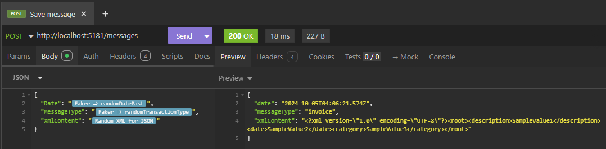

# Insomnia Plugin: Random XML for JSON Property

This Insomnia plugin generates extremely simple, dummy and valid pseudo-random XML samples that are ready to be used inside JSON properties. The generated XML is compact and properly escaped to ensure compatibility with JSON parsers.

## Features

- Generate pseudo-random XML with customizable root element and child elements.
- Ensures all double quotes are escaped for JSON compatibility.
- Compact XML format without unnecessary newlines.
- Real-world-like XML element names for better usability.

## Installation

1. Download or clone this repository.
2. Place the folder in your Insomnia plugins directory.
3. Restart Insomnia to load the plugin.

## Usage

1. Open Insomnia and create or edit a request.
2. Use the `Random XML for JSON` template tag.
3. Configure the root element name and the number of child elements.
4. The plugin will generate a random XML string, escaped and ready to be used in JSON properties.

## Example



Input:

```json
{
  "Date": "",
  "MessageType": "",
  "XmlContent": ""
}
```

Output:

```json
{
  "date": "2024-09-03T23:36:11.868Z",
  "messageType": "withdrawal",
  "xmlContent": "<root><address>SampleValue1</address><date>SampleValue2</date><status>SampleValue3</status></root>"
}
```

## Development

To modify or enhance the plugin:

1. Edit the `main.js` file.
2. Test your changes by restarting Insomnia.

## License

This plugin is open-source and available under the MIT License.
